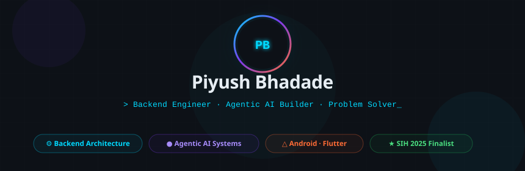

<div align="center">



<br/>

<!-- Typing SVG -->


<br/>

[](https://linkedin.com/in/piyushbhadade27)
[](mailto:piyushbhadade27@gmail.com)
[](https://github.com/CreativeSpace27)
[](#)

<br/>


</div>

---

<div align="center">

## `> whoami`

</div>

```python
class Piyush:
    role        = "Backend Engineer & Agentic AI Builder"
    location    = "📍 Pune, Maharashtra, India"
    education   = "B.E. CS @ Dr. D.Y. Patil Technical Campus (2027)  |  SGPA: 8.59"

    passions    = {
        "🔧 Backend"    : "Architecting systems that scale and never break",
        "🤖 Agentic AI" : "Multi-agent LLMs that reason, retrieve, and explain",
        "📱 Mobile"     : "Android & Flutter apps with intuitive UX",
        "🧩 Problems"   : "Real-world challenges → elegant software solutions",
    }

    currently   = "Exploring RAG pipelines & distributed agentic workflows"
    motto       = "Ship fast. Think deep. Build things that matter. 🚀"
```

---

## 🛠️ Tech Stack

<div align="center">

**Languages**


<br/><br/>

**Backend & Web**


<br/><br/>

**Mobile & Design**


<br/><br/>

**Databases & Cloud**


<br/><br/>

**AI / LLM Ecosystem**


<br/><br/>

**Testing & QA**


</div>

---

## 🚀 Projects

<div align="center">

| ✦ | Project | What it does |
|:---:|---------|------------|
| 🧠 | **[Organizational Memory Engine](https://github.com/CreativeSpace27)** | Multi-agent AI that stores & reasons over org decisions using semantic search + local LLMs, with source attribution. |
| 🔒 | **[LinkUp – Parental Control App](https://github.com/CreativeSpace27)** | Cloud-synced parental governance that can't be bypassed — real-time screen-time control that survives reinstalls. |
| 🌐 | **[Problem Sphere](https://github.com/CreativeSpace27)** | Open platform connecting problem-holders with solvers — crowdsourcing innovation from real-world challenges. |

</div>

---

## 📊 GitHub Stats

<div align="center">


<br/><br/>


</div>

---

## 🏆 Achievements

<div align="center">


<br/><br/>

| Medal | Achievement | Year |
|:---:|---|:---:|
| 🥇 | **1st Rank** — CodeSpark | 2025 |
| 🏅 | **SIH Finalist** — Smart India Hackathon | 2025 |
| 🥈 | **2nd Place** — National Technical Competition | — |
| 🥉 | **3rd Rank** — Gondia Conclave | 2024 |
| 🥉 | **3rd Rank** — Codex Competition | 2023–24 |

</div>

---

## 💼 Experience

```
▸ 2026   🧪  Lead Software Testing Engineer (Intern)  @  The Skill Guru Foundation
              Designed test cases, led remote QA, managed full defect lifecycle

▸ 2024   📱  Android Development Intern               @  Ur Engineering Friend
              Full-stack Android (Java + XML), UI/UX design & architecture patterns

▸ 2024   ☕  Java Backend Intern                      @  Info Origin Pvt. Ltd.
              Core Java, DB connectivity, DSA applied to real product features
```

---

<div align="center">

### 🤝 Let's build something that matters

*"The best software solves real problems for real people."*

<br/>

[](mailto:piyushbhadade27@gmail.com)
&nbsp;&nbsp;
[](tel:+917378413889)

<br/>


</div>
